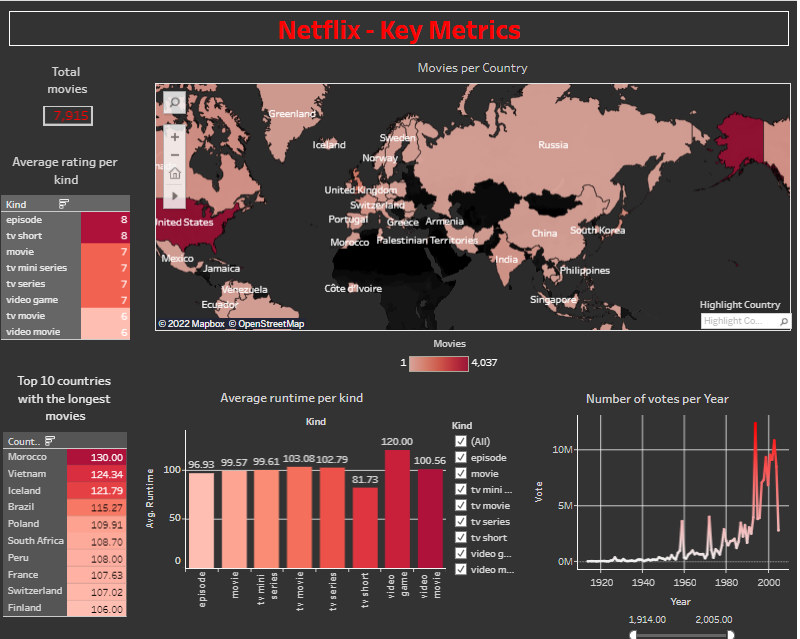

# Project week 7 | Supervised Learning
*[Ingrid Yondo, Radoslaw Debek]*

*[Data Analytics, Paris, 28.01.2022]*

## Content

- [Project week 7 | Supervised Learning](#project-week-7--supervised-learning)
	- [Content](#content)
	- [Project Description](#project-description)
	- [Requirements](#requirements)
	- [Workflow](#workflow)
	- [Dashboard Description](#dashboard-description)
	- [Models](#models)
		- [Ridge Classifier](#ridge-classifier)
		- [SVC](#svc)
		- [CategoricalNB](#categoricalnb)
		- [Extra Trees Classifier](#extra-trees-classifier)
		- [Results - best model](#results---best-model)
	- [Links](#links)

## Project Description
The aim of this project is to invesitgate 4 diffrent models for supervised machine learnig. As a dataset the Netflix movies data was used. Based on the analysis of the data dashboard was prepared which showed the most important parameters/charts which describe dataset.
After analysis of the results of data modelling, the best model was selected for analysed dataset.

## Requirements

- Clean and commented code
- Clean data with EDA
- Clear board in Trello with logged time for each task
- Clear description of each model
- Models implementation and comparison (required parameters: accuracy, recall, precision, ROC_AUC)
- Dashboard created in Tableau or Streamlit which presents dataset

## Workflow
The whole work in the project was organised using Trello platform. The main steps of the projest are presented below:

1. Organizing work in Trello/brainstorming ideas.
2. Getting to know the data.
3. Analysis of Data.
4. Data cleaing.
5. Calaculation of parpametrs to be presented on the Dashboard.
6. Encoding data.
7. Creating new Jupyter notebook to analyse models.
8. Deciding how to divide data into classes (3 variants were analysed).
9. Features selection
10. Hyperparameters tunning for each investigated model.
11. Models testing.
12. Analysing results - choosing the best model.
13. Creating Dashboard.
14. Preparing deliverables (readme file, Git-Hub repository, presenation).

## Dashboard Description

Below is presented the description of the Dashboard and the KPI presented on it. The KPIs vere created from the user perspective. Thus below are presented the user stories for each KPI.

| **KPI 1 – Number of movies**                                                       |
|--------------------------------------------------------------------------------|
| As a buyer manager at Netflix                                                  |
| I want the number of movies                                                    |
| So that I know the total number of movies offered to our consumers to vote for |
| **KPI 2 – Average rating per kind**                                                                         |
| As a buyer manager at Netflix                                                                           |
| I want the average rating per kind                                                                      |
| So that I know which kind is preferred by our consumers                                                 |
|                                                                                                         |
| **KPI 3 – Top 10 Countries with the longest movies**                                                        |
| As a buyer manager at Netflix                                                                           |
| I want the top 10 Countries with the longest movies                                                     |
| So that I know the countries producing the longest movies                                               |
|                                                                                                         |
| **KPI 4 – Average runtime per kind**                                                                        |
| As a buyer manager at Netflix                                                                           |
| I want the average runtime per kind                                                                     |
| So that I know which kind of movies are longer and if there is a correlation with the most liked movies |
|                                                                                                         |
| **KPI 5 – Movies per country**                                                                              |
| As a buyer manager at Netflix                                                                           |
| I want the number of movies per country                                                                 |
| So that I know how many movies are produced per country                                                 |
|                                                                                                         |
| **KPI 6 – Number of votes per year**                                                                        |
| As a buyer manager at Netflix                                                                           |
| I want the number of votes per year                                                                     |
| So that I know when the people voted the most and the least                                             |

## Models

Our group investigated 4 models:
- Ridge Classifier,
- SVC,
- Categorical NB, and
- Extra Trees Classifier

### Ridge Classifier

Classifier uses Ridge regression.
This classifier first converts the target values into {-1, 1} and then treats the problem as a regression task (multi-output regression in the multiclass case).
It is necessary to standarize data before using Ridge Classifier.

### SVC
SVC (Support Vector Classification) is a part of Support Vector Machines models. SVC performs binary or multiclass classifcation on the data.
SVC implement the “one-versus-one” approach for multi-class classification. In total, n_classes * (n_classes - 1) / 2 classifiers are constructed and each one trains data from two classes. To provide a consistent interface with other classifiers, the decision_function_shape option allows to monotonically transform the results of the “one-versus-one” classifiers to a “one-vs-rest” decision function of shape (n_samples, n_classes).
It was recommended to standrize data before implementing the SVC model.

### CategoricalNB
Naïve Bayes classifier belongs to a family of probabilistic classifiers based on Bayes Theorem with a strong assumption of independence between the features. These are not only fast and reliable but also simple and easiest classifier which is proving its stability in machine learning world. Despite its simplicity, it gives accurate prediction in text classification problems.
This model doesn't require stqndqrizqtion of the data.

### Extra Trees Classifier
Extremely Randomized Trees Classifier(Extra Trees Classifier) is a type of ensemble learning technique which aggregates the results of multiple de-correlated decision trees collected in a “forest” to output it’s classification result. In concept, it is very similar to a Random Forest Classifier and only differs from it in the manner of construction of the decision trees in the forest.

Each Decision Tree in the Extra Trees Forest is constructed from the original training sample. Then, at each test node, Each tree is provided with a random sample of k features from the feature-set from which each decision tree must select the best feature to split the data based on some mathematical criteria (typically the Gini Index). This random sample of features leads to the creation of multiple de-correlated decision trees.

The Extra Trees Classifier does not require standarization fo the data

### Results - best model

In our case we analysed 3 datasets. We decided to divide the same data into 2,3 and 7 diffrent classes. We did that because all of the models gave poor results in terms of all paramaters (precision, accuracy etc.), when data was divided into 7 classes. Maximal accuracy in that case was obtained for Extra Trees Classifier at the level of 47%. For this case Ridge Classifier gave the worst results (accuracy at the level of 33% and it didn't classified correctly several classes at all).

In order to improve our models scores we decided to split data into 3 categories inseted of 7. These categories were selected basing on the movie rating, as well as the number of movies in each class. We wanted to work with well balanced data.
Splitting into 3 classes insted of 7 improved significantly scores of each model. The overall performance of models with 3 classes followed the sequence:

Ridge Classifier ~ CategoricalNB < SVC << Extra Trees Classifier.

As 3 out of 4 tested models work good with binary data, we decided to re-test the models for data separated into 2 classes: good and bad movies. This infact improved the score of each model. They performance followed the sequence:

Ridge Classifier < CategoricalNB ~ SVC << Extra Trees Calassifier (79% accuracy)

In all 3 tested cases the best performance was shown by the Extra Trees Classifier. Therefore, for supervised learning of Netflix movies dataset we recommend to:

- divide clean data into 2 categories,
- use Extra Trees Classifier for modelling.

## Links

[Dashboard](https://public.tableau.com/app/profile/ingrid.mongori.yondo/viz/Netflix-KeyMetrics/Tableaudebord22?publish=yes7)
[Repository](https://github.com/radek-deb/Projects_IronHack/tree/main/Project7_Supervised_Learning)
[Slides](https://docs.google.com/presentation/d/1-UawEBPkw1g8A-YasbdqLyOJM2S6boQm/edit?usp=sharing&ouid=102785489791173764779&rtpof=true&sd=true)
[Trello](https://trello.com/b/0CaafrSY/project7group1)
