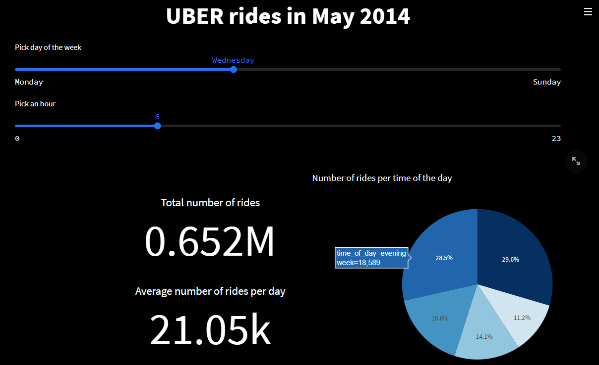
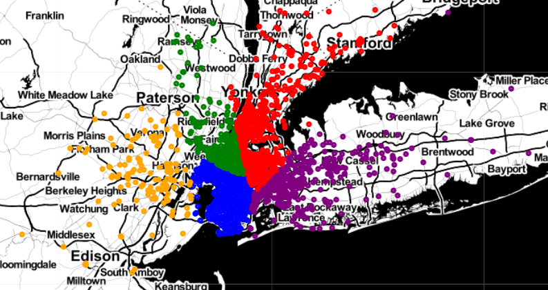

### Project | Module 3 | Uber ride clusters

## Project description
Use of unsupervised machine learning to create recommendation algorithm.
Imagine you are Uber and you want to give recommendations on where drivers should be to maximize their chances of finding a ride. 
Dataset is related to May 2014 rides in New York city.

## Models

In the project we investigated 5 unsupervised machine learning models:
- Kmeans
- DBSCAN
- Agglomerative clustering
- Optics
- Means_shift

## Project Timing and Activities

1. Data cleaning
2. Selection of models and optimal clusters number identification, leveraging Elbow method
3. Models implementation and comparison
4. Visualization including on map through folium library

## Comparison of the models

|                           | n_clusters | Silhouette Coefficient | Variance Ratio Criterion | Davides Bouldin score |
|---------------------------|------------|------------------------|--------------------------|-----------------------|
| k_means                   | 5          | 0.430333496            | 39927.76148              | 0.676886623           |
| Agglomerative_clusstering | 5          | 0.429160732            | 36744.3001               | 0.679902258           |
| DBSCAN                    | 11         | 0.21731913             | 4126.136716              | 2.052352237           |
| optics                    | 4094       | -0.047741133           | 20.56487453              | 1.74942336            |
| means_shift               | 84         | 0.500448645            | 2319.937219              | 0.501251184           |

Basing on the obtained results for the clustering of the data and further analysis we selected KMeans model.

## Map with pickup locations

## Links
[Streamlit](https://project8-usml.herokuapp.com/)
[Repository](https://github.com/radek-deb/Projects_IronHack/tree/main/Project8_Unsupervised_Learning)
[Slides](https://docs.google.com/presentation/d/1PqQfyBkZfKNozHVBF8y-kZG94Mla6Ryp/edit?usp=sharing&ouid=102785489791173764779&rtpof=true&sd=true)
[Trello](https://trello.com/b/jeJWeXZX/project-8)

